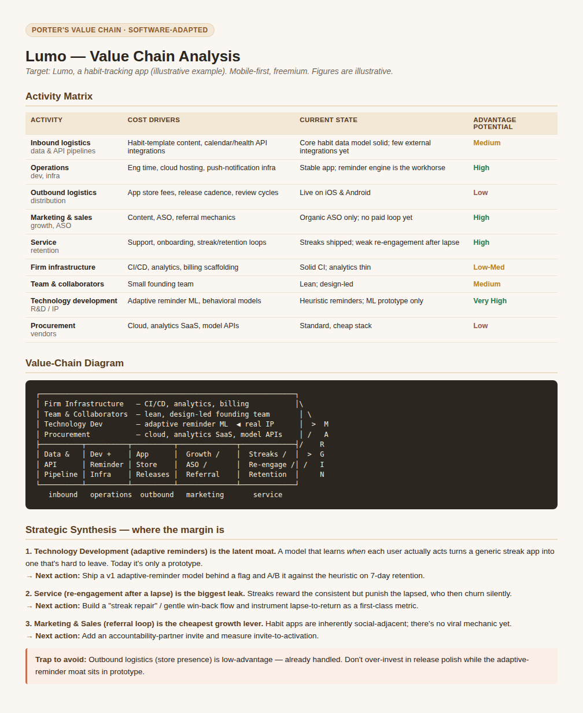

# Porter's Value Chain — Claude Skill

A [Claude Code](https://claude.com/claude-code) plugin that applies Michael
Porter's **Value Chain** framework to find where competitive advantage and
margin are created — for an external company **or** one of your own software
projects.

## What it does

When invoked, the skill drives a five-step analysis:

1. **Identify the target** — a company, or one of your own projects (it pulls
   context from your repo where it can).
2. **Pick a mode** (asked up front):
   - **Classic** — the literal nine Porter activities.
   - **Software-adapted** — Porter's structure translated for software/app
     projects (e.g. *inbound logistics → data/content & API pipelines*,
     *operations → dev & infra*, *service → support & retention*).
3. **Activity matrix** — each activity scored on cost drivers, current state,
   and competitive-advantage potential.
4. **Value-chain diagram** — the classic support-bands-over-primary-arrow shape,
   rendered inline.
5. **Strategic synthesis** — the 2–3 activities that are the real source of (or
   biggest threat to) advantage/margin, with concrete prioritized next actions.

It also has a lightweight **teaching mode** for "just explain the framework"
requests.

## Example output

A run on a fictional habit-tracking app (illustrative):



## Install (recommended — as a plugin)

In Claude Code, add this repo as a marketplace, then install the plugin:

```
/plugin marketplace add InfiniteInsight/PortersValueChain-ClaudeSkill
/plugin install porters-value-chain@infiniteinsight
```

`infiniteinsight` is the marketplace name; `porters-value-chain` is the plugin.
Once installed, the skill auto-triggers on phrases like "value chain",
"competitive advantage", "where's the margin", or "strategy breakdown". You can
also invoke it manually as `/porters-value-chain:porters-value-chain`.

## Install (manual — without the plugin system)

Copy just the skill folder into your personal skills directory:

```bash
git clone https://github.com/InfiniteInsight/PortersValueChain-ClaudeSkill /tmp/pvc
cp -r /tmp/pvc/skills/porters-value-chain ~/.claude/skills/porters-value-chain
```

Then restart Claude Code. Invoked manually as `/porters-value-chain`.

## Repo layout

```
PortersValueChain-ClaudeSkill/
├── .claude-plugin/
│   ├── plugin.json                 # marks this repo a plugin
│   └── marketplace.json            # marks this repo a marketplace (source: "./")
├── skills/
│   └── porters-value-chain/
│       ├── SKILL.md                # the skill: trigger + workflow
│       ├── references/
│       │   └── translation-table.md
│       └── assets/
│           └── example-analysis.png
├── README.md
└── LICENSE
```

## Usage

Just ask, e.g.:

- "Run a Porter's value chain on Notion."
- "Do a value-chain breakdown of my project to find where the margin is."
- "Explain Porter's value chain." *(teaching mode)*

## License

MIT
